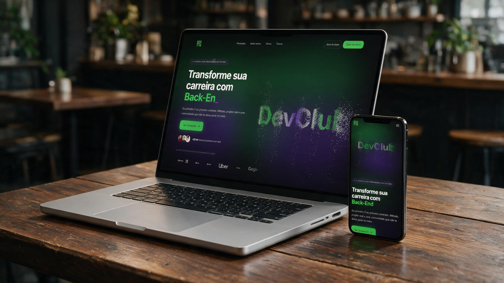

# 🟢 DevClub — A Escola das Profissões do Futuro



Landing page institucional construída para o **Concurso DevClub · Vaga de Programador(a) Full Stack**. 17 seções, cinco mecânicas de animação 3D construídas do zero, sistema de temas dinâmico e ~13 mil partículas interativas no hero.

---

## 🌐 Aplicação Online

**🔗 Site:** [https://devclub.jardsonflorentino.com.br/](https://devclub.jardsonflorentino.com.br/)

> 💡 Recarregue a página para ver a animação de abertura completa — as partículas nascem dispersas, formam o nome e viajam até o hero sem corte.

### 🎮 Interações escondidas no hero

| Ação | Resultado |
|------|-----------|
| **Clique** nas partículas | Dispara uma onda de choque radial |
| **Segure e solte** | Carrega a onda — quanto mais tempo, maior o impacto |
| **Duplo clique** | Cicla entre 3 temas e repinta o site inteiro |
| **Incline o celular** | O giroscópio move a cena (parallax no mobile) |

---

## 📝 Sobre o projeto

Página institucional completa do DevClub, com direção de arte **dark premium**. O princípio de design foi: **cada seção tem uma assinatura visual própria** — nenhuma repete a mecânica da outra — amarradas por um sistema consistente de cor, movimento e microinterações.

O desafio pedia uma página "disruptiva", avaliada em **50% impacto visual · 30% animações e microinterações · 20% qualidade de código**.

---

## ✨ Destaques

### Hero com partículas 3D
- ~13.000 partículas em Three.js formando o texto "DevClub"
- Texto amostrado de um canvas offscreen (`getImageData`) — não é modelo 3D
- Onda de choque radial com decaimento gaussiano ao clique
- Ciclo contínuo de desintegração e reconstrução

### Preloader contínuo
- Não existe "tela de loading" separada: a mesma cena 3D nasce dispersa, forma o nome centralizado e viaja até a posição do hero
- O enquadramento é interpolado via `camera.setViewOffset` — sem corte, sem cortina

### Sistema de temas
- 3 paletas (`devclub`, `matrix`, `deep-purple`) que repintam o site inteiro
- Nenhum componente conhece cor absoluta: tudo lê `--accent-1` / `--accent-2`

### Cinco mecânicas 3D, zero bibliotecas de carrossel
| Seção | Mecânica |
|-------|----------|
| **Formações** | Esteira curva em perspectiva + scroll pinado + filtro por categorias |
| **Tecnologias** | Órbita elíptica dupla contra-rotativa com 23 tecnologias |
| **Tutores** | Coverflow 3D com navegação por clique, arraste e teclado |
| **Projetos** | Anel 3D giratório com inércia no arraste |
| **Plataforma** | Sticky scroll com troca de painel por feature (acordeão no mobile) |

---

## 🛠️ Stack Tecnológica

### Core
- **Next.js 15** (App Router) — estrutura, otimização de imagens/fontes, deploy na Vercel
- **TypeScript** — tipagem em todo o projeto
- **Tailwind CSS v4** — tokens via `@theme`, o que faz o sistema de temas atravessar as classes utilitárias

### Animação
- **Three.js** (puro, sem React Three Fiber) — controle direto dos buffers de 13k partículas por frame
- **GSAP + ScrollTrigger** — pin, scrub e recálculo dinâmico de percurso
- **Lenis** — smooth scroll integrado ao ticker do GSAP
- **CSS Transforms** — todas as mecânicas 3D (coverflow, órbita, anel, esteira, leque)

### Infraestrutura
- **Vercel** — deploy contínuo a cada push
- **lucide-react** — ícones

---

## 🧠 Decisões técnicas

### Por que Three.js puro e não React Three Fiber?
O componente manipula buffers de posição, cor e tamanho de 13 mil partículas a cada frame. Three puro dá acesso direto aos atributos de geometria sem camada de abstração. R3F é excelente para cenas declarativas — aqui seria overhead sem ganho.

### Como o texto vira partículas
"DevClub" é desenhado em um canvas invisível e amostrado com `getImageData`: cada pixel com `alpha > 128` vira posição-alvo de uma partícula. O `document.fonts.load()` é chamado explicitamente porque o `fonts.ready` sozinho não garante o download do peso 700 — sem isso, a amostragem pega a fonte fallback. Os pontos são ordenados por X para que o efeito de fluxo percorra as letras da esquerda para a direita.

### Performance com cinco cenas animadas
Todos os loops de `requestAnimationFrame` são pausados quando a seção sai da viewport (`IntersectionObserver`). As animações usam exclusivamente `transform` e `opacity` — composição na GPU, sem reflow. No gráfico de salários, por exemplo, apenas `scaleX` é animado com `transform-origin: left`, mantendo os rótulos estáticos.

### Por que o player de vídeo abre em portal
Dentro do leque de Módulos Bônus, os cards vivem sob `perspective` e `transform-style: preserve-3d`. Um `<iframe>` nesse contexto herda a matriz 3D e renderiza distorcido. O modal é montado via `createPortal` no `body`, fora da árvore transformada.

### Mobile não é o desktop encolhido
O hero cai para ~4.000 partículas sem bloom. As interações de mouse viram toque (tap = pulse, hold = charge, duplo toque = tema) e o parallax vira giroscópio, com `DeviceOrientationEvent.requestPermission()` para iOS 13+ e fallback silencioso. A Plataforma troca o sticky scroll por um acordeão com mockups.

### Acessibilidade
`prefers-reduced-motion` é respeitado em todas as seções — as cenas 3D viram grades estáticas navegáveis. Foco visível, `alt` em imagens, e contraste verificado nos blocos de destaque.

---

## 📦 Instalação Local

### Pré-requisitos
- Node.js 18+
- npm ou yarn

```bash
# Clone o repositório
git clone https://github.com/JardsonFlorentino/concurso-devclub
cd concurso-devclub

# Instale as dependências
npm install

# Inicie o servidor de desenvolvimento
npm run dev
```

Acesse `http://localhost:3000`

---

## 📁 Estrutura de Pastas

```
src/
├── app/
│   ├── globals.css       # Design tokens, temas, keyframes
│   ├── layout.tsx        # Header, SmoothScroll, fontes
│   └── page.tsx          # Composição das 17 seções
├── components/
│   ├── sections/         # Uma seção por componente
│   │   ├── HeroSection.tsx
│   │   ├── FormacoesSection.tsx
│   │   ├── TecnologiasSection.tsx
│   │   └── ...
│   ├── three/
│   │   └── ParticleTextScene.tsx    # Cena de partículas do hero
│   └── ui/               # Componentes reutilizáveis
│       ├── TutoresCoverflow.tsx
│       ├── ProjetosRing.tsx
│       ├── VideoLightbox.tsx
│       └── ...
├── data/                 # Todo o conteúdo (nunca hardcoded no JSX)
│   ├── formacoes.ts
│   ├── tecnologias.ts
│   └── ...
└── hooks/                # useFinePointer, useMagnetic, useHeroReveal
```

---

## 🎨 Design System

| Token | Valor | Uso |
|-------|-------|-----|
| `--black-dark` | `#111012` | Fundo base |
| `--accent-1` | `#39D353` | Acento primário (verde) |
| `--accent-2` | `#8532F2` | Acento secundário (roxo) |
| `--white-light` | `#F5F5F7` | Texto principal |

**Sistema de movimento:** easing `power3.out`, durações de 0.8s a 1.2s, entradas com `opacity 0→1` + `y: 28→0` e stagger de 0.1s. Sem bounce, sem elastic, sem rotação decorativa.

---

## 🙏 Créditos

A animação de partículas do hero foi adaptada do componente **StarShockwaves** (21st.dev). A forma foi trocada de estrela para texto amostrado por canvas; textura, rotação, fluxo e sistema de temas foram reescritos. O comportamento de onda de choque e o ciclo de desintegração foram preservados e são creditados ao autor original.

Conteúdo institucional (nomes, depoimentos, números) é fictício, criado para o concurso conforme autorizado no edital.

---

## 🙋‍♂️ Autor

**Jardson Florentino**

Desenvolvedor Full Stack | DevClub Student

- 🌐 [Portfólio](https://www.jardsonflorentino.com.br)
- 💼 [LinkedIn](https://www.linkedin.com/in/jardsonflorentino)
- 🐙 [GitHub](https://github.com/JardsonFlorentino)
- 📧 [jardsonflorentino@gmail.com](mailto:jardsonflorentino@gmail.com)

---

<div align="center">

**Feito com sangue no zóio** 🔥

</div>